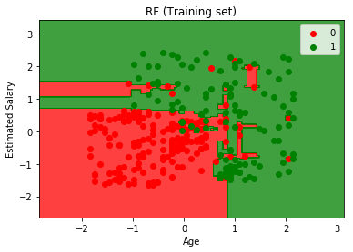

# new-luxury-SUV-brand-purchase-classification
new luxury SUV brand purchase  classification, we train more than model to classify woho will purchase this luxury depends on Age and estemited sallary,evaluate every model using confusion matrix and choose the best 

 <h2>Logistic regression</h2>
 
  
 
 
 <h2>K-Nearst_Neighbour</h2>
 
  
 
 
 <h2>SVM</h2>
 
  
 
  
  <h2>Kernel-SVM</h2>
 
  
 

  
  <h2>Naive Bayes</h2>
 
  
 
 
  <h2>Dession tree</h2>
 
  
 
 
  <h2>Random forest</h2>
 
  
 

